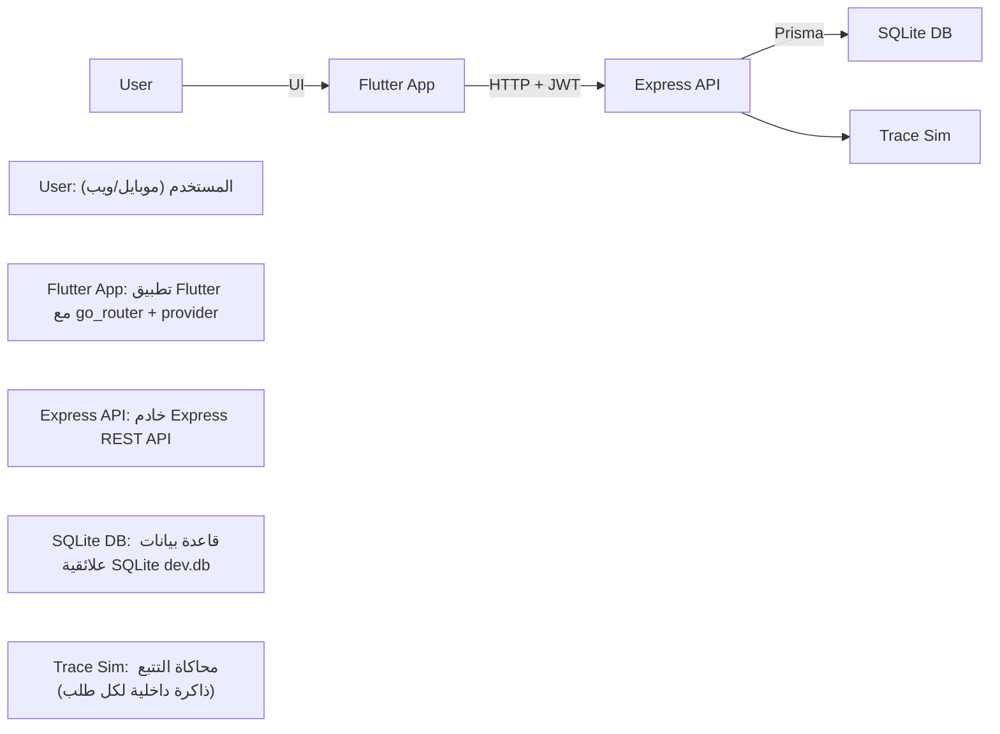
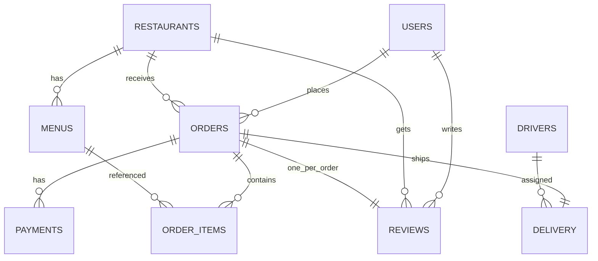
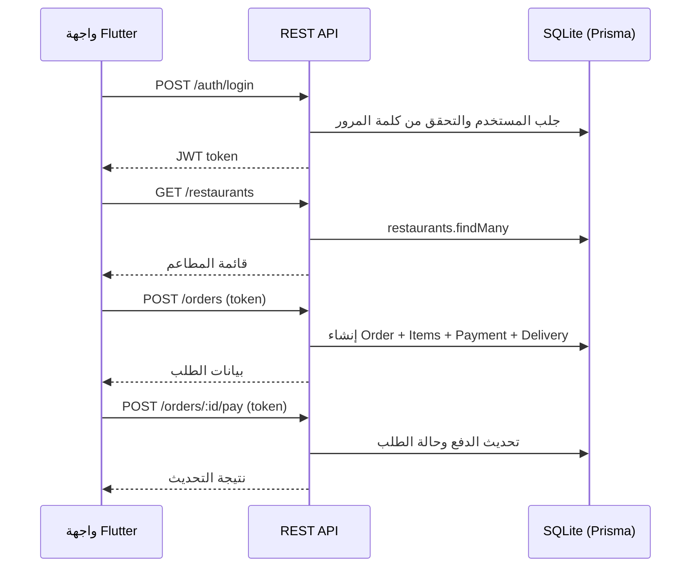
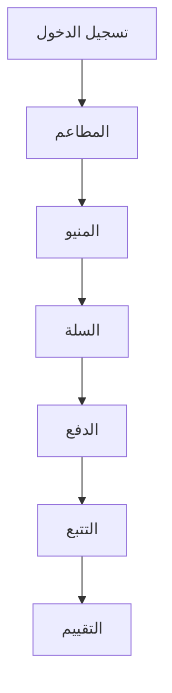

# تقرير مشروع توصيل الطعام (Flutter + REST) — عربي
## فيديو DEMO: 

https://drive.google.com/file/d/1w0T6A8NMzYolgZXF_ZaY3jPyCvh71-cA/view?usp=sharing  

<video src="https://drive.google.com/file/d/1w0T6A8NMzYolgZXF_ZaY3jPyCvh71-cA/view?usp=sharing" controls title="Demo video"></video>

## 1) نظرة عامة

تم تنفيذ تطبيق **توصيل طعام بواجهة Mobile‑First** باستخدام:

- **الواجهة الأمامية:** Flutter (مشروع Web + Android)
- **الخلفية:** Node.js (Express) REST API
- **قاعدة البيانات:** تصميم علائقي عبر Prisma، وتم اعتماد **SQLite محلياً** لضمان التشغيل على Windows بسبب مشاكل Docker.

رحلة المستخدم المنفّذة:

1. تسجيل الدخول (اسم مستخدم/كلمة مرور)
2. اختيار مطعم
3. اختيار عناصر المنيو (صور + سعر + توفر + ملاحظة تخصيص)
4. سلة المشتريات والدفع (عنوان + طريقة دفع + تقدير زمن التوصيل)
5. تتبّع الطلب (تحديث شبه لحظي عبر polling)
6. تقييم وملاحظات (نجوم + تعليق اختياري)

## 2) المعمارية

### 2.1 الفكرة العامة

- تطبيق Flutter يتواصل مع الخادم عبر HTTP (Dio).
- خادم Express يوفّر REST endpoints ويستخدم Prisma للتعامل مع قاعدة البيانات.

### 2.2 مخطط المعمارية (Chart)

### 2.3 المجلدات

- **الخادم:** `backend/`
- **تطبيق Flutter:** `food_delivery_app/`

### 2.4 أهم الحزم

**Flutter:**

- `dio` للاتصال بالشبكة
- `provider` لإدارة الحالة
- `go_router` للتنقّل والمسارات
- `shared_preferences` لتخزين التوكن محلياً

**Backend:**

- `express`, `cors`, `dotenv`
- `zod` للتحقق من المدخلات
- `bcryptjs` لتشفير كلمات المرور
- `jsonwebtoken` لـ JWT
- `prisma` + `@prisma/client` كـ ORM

## 3) تصميم قاعدة البيانات

تم تنفيذ المخطط العلائقي وفق جداول التكليف المطلوبة عبر Prisma.

الجداول (Models):

- `users`
- `restaurants`
- `menus`
- `orders`
- `order_items`
- `payments`
- `delivery`
- `drivers`
- `reviews`

ملاحظات:

- استخدام SQLite محلياً: `backend/dev.db`
- ملفات المخطط:
  - SQLite محلي: `backend/prisma/schema.local.prisma`
  - Postgres (اختياري لاحقاً): `backend/prisma/schema.prisma`

### 3.1 مخطط العلاقات ER (Chart)

### 3.2 ملاحظات التصميم

- تم الالتزام بجداول التكليف مع علاقات واضحة بين المستخدم/الطلبات/المطاعم/المنيو.
- قيم المال مخزنة كـ Decimal في Prisma.
- إحداثيات التتبع غير مخزنة في DB لأن جداول التكليف لا تحتوي أعمدة لذلك؛ تم تنفيذ التتبع كمحاكاة في الذاكرة ويتم إرجاعه عبر `/orders/:id/tracking`.

## 4) واجهة REST للخادم

### 4.1 العنوان الأساسي

الخادم يعمل محلياً على:

- **`http://localhost:3001`**

تم تغيير المنفذ إلى 3001 لأن المنفذ 3000 كان مستخدماً من برنامج آخر.

### 4.1.1 ماذا يفعل الخادم (تفصيل أكثر)

- تسجيل دخول باستخدام JWT (Bearer token) مع تشفير كلمة المرور عبر bcrypt.
- التحقق من المدخلات عبر Zod.
- تنفيذ الموارد الأساسية: مطاعم، منيو، طلبات، دفع، توصيل، سائقين، تقييم.
- عند إنشاء طلب يتم اختيار أول سائق متاح ثم يصبح غير متاح حتى يتم التسليم.

### 4.1.2 تسلسل الطلب (Chart)

### 4.2 أهم المسارات

عام:

- `GET /` (صفحة تعريفية بسيطة)
- `GET /health`
- `GET /restaurants`
- `GET /restaurants/:id/menus`

تسجيل الدخول:

- `POST /auth/login`
- `POST /auth/register` (إضافي للتجربة)

الطلبات:

- `POST /orders`
- `POST /orders/:id/pay`
- `GET /orders/:id`
- `GET /orders/:id/tracking` (محاكاة موقع السائق + ETA)
- `POST /orders/:id/mark-delivered`

التقييم:

- `POST /reviews` (مسموح فقط بعد التسليم)

### 4.3 بيانات تجريبية (Seed)

ملف `backend/prisma/seed.js` يُضيف:

- مستخدم تجريبي
- عدة مطاعم
- عناصر منيو مع روابط صور
- سائقين

بيانات الدخول التجريبية:

- اسم المستخدم: `demo@svu.com`
- كلمة المرور: `password123`

### 4.4 اختبار شامل للخادم

تم توفير سكربت فحص كامل للتأكد من عمل الرحلة كاملة على مستوى API:

- `backend/scripts/smoke-test.js`
- التشغيل: `npm --prefix backend run smoke:test`

## 5) تطبيق Flutter

### 5.1 نقطة البداية

تم ربط التطبيق بنقطة التشغيل الصحيحة (بدلاً من تطبيق العداد الافتراضي):

- `food_delivery_app/lib/main.dart` → `App()`

### 5.1.1 ماذا تفعل الواجهة (تفصيل أكثر)

- استخدام `go_router` للتنقل مع حراسة المسارات (من دون تسجيل دخول يتم إعادة التوجيه إلى صفحة Login).
- إدارة الحالة عبر `provider`:
  - `AuthState`: تسجيل الدخول/الخروج + حفظ التوكن في SharedPreferences
  - `CartState`: عناصر السلة، الكميات، المجموع، والسلة لمطعم واحد
- `ApiService` (Dio) كعميل HTTP موحد لكل النداءات.

### 5.2 التنقّل (Routing)

- `/` تسجيل الدخول
- `/restaurants` قائمة المطاعم
- `/restaurants/:id` قائمة المنيو
- `/cart` السلة
- `/checkout/:restaurantId` الدفع
- `/tracking/:orderId` التتبع
- `/feedback/:orderId` التقييم

### 5.3 الشاشات المنفذة

- تسجيل دخول مع تحقق من الإدخال
- قائمة مطاعم
- منيو مع صور وإضافة للسلة + ملاحظة تخصيص
- سلة: تعديل الكمية + المجموع
- الدفع: عنوان + طريقة دفع + إنشاء طلب + دفع تجريبي
- التتبع: polling كل 5 ثوانٍ وإظهار ETA والسائق
- التقييم: نجوم 1–5 وتعليق اختياري

### 5.3.1 رحلة المستخدم (Chart)

### 5.4 عناوين API داخل Flutter

- للويب: `http://localhost:3001`
- لمحاكي Android: `http://10.0.2.2:3001`

المسار: `food_delivery_app/lib/core/api_service.dart`

## 6) طريقة التشغيل

### 6.1 تشغيل الخادم

من جذر المشروع:

- تثبيت: `npm --prefix backend install`
- توليد Prisma: `npm --prefix backend run prisma:generate`
- ترحيل DB: `npm --prefix backend run prisma:migrate`
- Seed: `npm --prefix backend run db:seed`

تشغيل الخادم (مستحسن عبر سكربتات PowerShell لتشغيله بالخلفية مع سجلات):

- تشغيل: `powershell -ExecutionPolicy Bypass -File backend/scripts/start-backend.ps1`
- إيقاف: `powershell -ExecutionPolicy Bypass -File backend/scripts/stop-backend.ps1`

فحص:

- `curl.exe http://localhost:3001/health`

### 6.2 تشغيل Flutter على الويب

- `cd food_delivery_app`
- `C:\Users\Tarek\Desktop\SVU\Mobile\tools\flutter\bin\flutter.bat pub get`
- `C:\Users\Tarek\Desktop\SVU\Mobile\tools\flutter\bin\flutter.bat run -d chrome`

### 6.3 حلول لمشاكل شائعة

- **ظهور صفحة العداد الافتراضية (Flutter Demo):** تأكد أن `food_delivery_app/lib/main.dart` يشغل `App()` وليس `MyApp`.
- **تعذر الوصول إلى الخادم من الويب:** تأكد أن `curl.exe http://localhost:3001/health` يعمل وأن الخادم يعمل على 3001.
- **المنفذ 3001 مشغول:** غيّر `PORT` في `backend/.env` وحدّث `food_delivery_app/lib/core/api_service.dart`.
- **Docker لا يعمل:** غير مطلوب لأننا نعتمد SQLite محلياً.

## 7) التحقق والاختبار

- Smoke test للخادم: `npm --prefix backend run smoke:test`
- فحص Flutter: `flutter analyze`
- تم تحديث اختبار Widget لضمان ظهور صفحة تسجيل الدخول.

## 8) ملاحظات/قيود

- **تشغيل محاكي Android API 36** يحتاج تثبيت Android Studio + SDK وضبطه (حسب `flutter doctor`).
- تم اعتماد SQLite محلياً بسبب مشاكل Docker على الجهاز، مع الحفاظ على نفس التصميم العلائقي.

## 9) خلاصة (Reflection)

- Prisma سهّل تمثيل العلاقات والجداول المطلوبة.
- SQLite وفّر تشغيلًا مضمونًا على Windows بدون الاعتماد على Docker.
- التتبع عبر polling يحقق “تحديث شبه لحظي” دون تعقيد WebSockets.

**روابط سريعة**

- واجهة API: `http://localhost:3001/`
- Health: `http://localhost:3001/health`
- Restaurants: `http://localhost:3001/restaurants`

