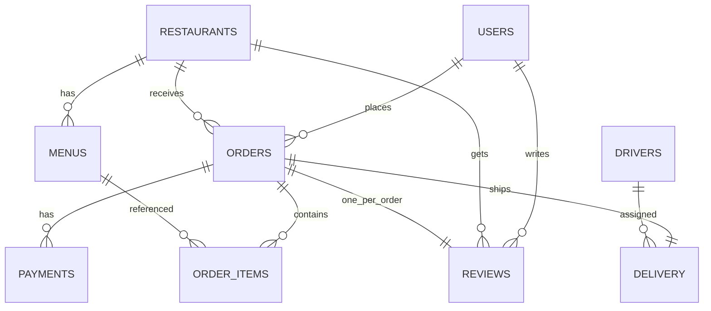
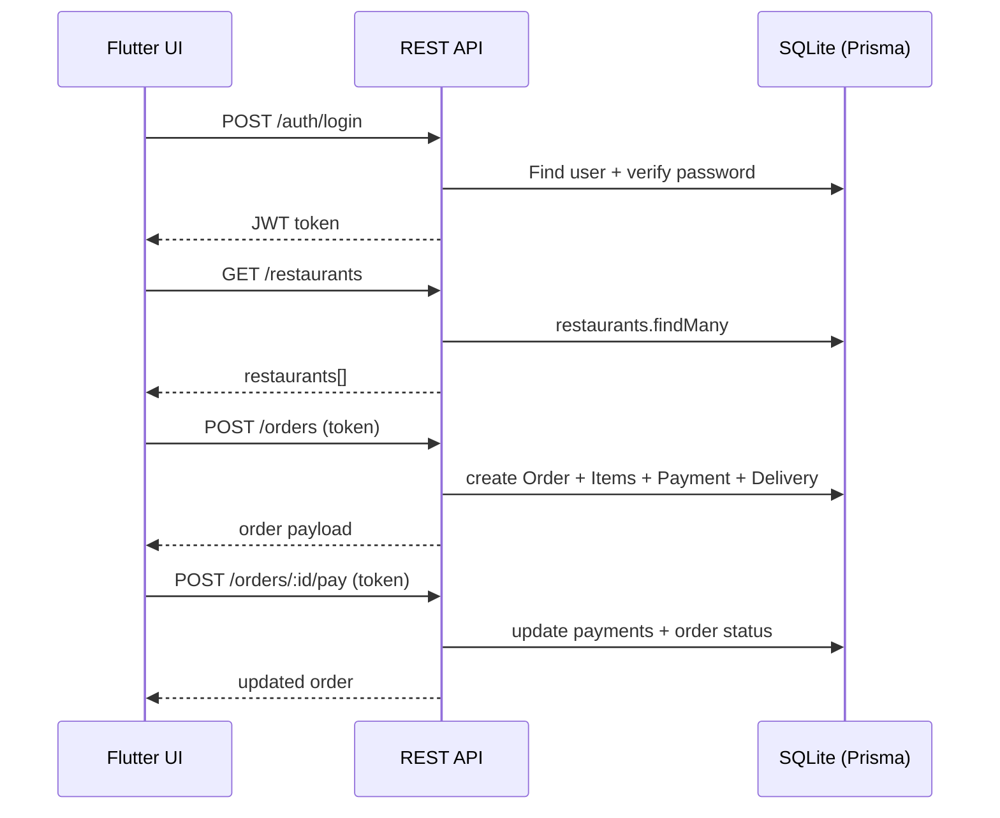
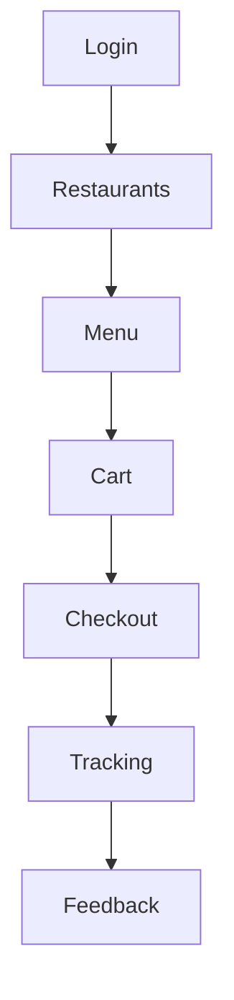

# Food Delivery (Flutter + REST) — Project Report (EN)

**Date:** 2026-01-15  
**Workspace:** `C:\Users\Tarek\Desktop\SVU\Mobile`

## 1) Overview

This project implements a **mobile-first food delivery application** using:

- **Frontend:** Flutter (Web + Android project scaffolded)
- **Backend:** Node.js (Express) REST API
- **Database:** Relational schema implemented via **Prisma** using a **local SQLite DB** for reliable Windows development (Docker was unstable).

User journey implemented:

1. Login (username/password)
2. Restaurant selection
3. Menu selection (images, price, availability, customization note)
4. Cart & checkout (address, payment method, estimated delivery time)
5. Order tracking (near real-time polling)
6. Feedback (rating + optional comment)

## 2) Architecture

### 2.1 High-level

- Flutter UI communicates with the backend via HTTP (Dio).
- Backend exposes REST endpoints and stores data via Prisma ORM.

### 2.2 Architecture diagram (Chart)

```mermaid
flowchart LR
  U[User (Mobile/Web)] -->|UI| F[Flutter App
  go_router + provider]
  F -->|HTTP (Dio) + JWT| A[Express REST API]
  A -->|Prisma ORM| DB[(Relational DB
  SQLite dev.db)]
  A --> T[Tracking Simulation
  (in-memory per order)]
```

### 2.3 Projects

- **Backend:** `backend/`
- **Flutter app:** `food_delivery_app/`

### 2.4 Key packages

**Flutter:**

- `dio` (HTTP)
- `provider` (state management)
- `go_router` (routing)
- `shared_preferences` (token persistence)

**Backend:**

- `express`, `cors`, `dotenv`
- `zod` (validation)
- `bcryptjs` (password hashing)
- `jsonwebtoken` (JWT auth)
- `prisma` + `@prisma/client` (ORM)

## 3) Database Design

A relational schema matching the assignment tables was implemented in Prisma.

Tables (models):

- `users`
- `restaurants`
- `menus`
- `orders`
- `order_items`
- `payments`
- `delivery`
- `drivers`
- `reviews`

Notes:

- SQLite is used for development stability: `backend/dev.db`.
- Schema files:
  - Local SQLite: `backend/prisma/schema.local.prisma`
  - Postgres (optional later): `backend/prisma/schema.prisma`

### 3.1 Entity-Relationship diagram (Chart)



### 3.2 Design notes

- The schema matches the assignment tables and keeps relations explicit (user→orders, restaurant→menus/orders, order→items/payments/delivery).
- Monetary values are stored as **Decimal** in Prisma models; for SQLite development, Prisma maps Decimal appropriately.
- Delivery tracking coordinates are **not stored** in DB (assignment tables do not include them). Tracking is simulated in-memory and served by `/orders/:id/tracking`.

## 4) Backend API

### 4.1 Base URL

- Local backend runs on: **`http://localhost:3001`**

Port 3000 was already occupied on the machine, so the project uses **3001**.

### 4.1.1 What the backend does (more detail)

- Implements authentication using JWT (Bearer token) and password hashing (bcrypt).
- Validates incoming payloads using Zod to reduce bad requests.
- Implements core resources: restaurants, menus, orders, payments, delivery assignment, and reviews.
- Assigns the first available driver when creating an order and marks them unavailable until delivery.

### 4.1.2 Request/response flow (Chart)



### 4.2 Endpoints

Public:

- `GET /` (friendly homepage)
- `GET /health`
- `GET /restaurants`
- `GET /restaurants/:id/menus`

Auth:

- `POST /auth/login`
- `POST /auth/register` (extra helper endpoint)

Orders:

- `POST /orders` (create order, create order items, create payment, assign driver)
- `POST /orders/:id/pay` (mark payment as paid)
- `GET /orders/:id` (order details)
- `GET /orders/:id/tracking` (tracking simulation: driver location + ETA)
- `POST /orders/:id/mark-delivered` (mark delivered and free driver)

Reviews:

- `POST /reviews` (only allowed after delivery)

### 4.3 Seed data

`backend/prisma/seed.js` inserts:

- Demo user
- Sample restaurants
- Sample menu items (with image URLs)
- Drivers

Demo login:

- username: `demo@svu.com`
- password: `password123`

### 4.4 Smoke test

A full end-to-end API verification script exists:

- `backend/scripts/smoke-test.js`
- Run: `npm --prefix backend run smoke:test`

This checks: login → restaurants → menus → create order → pay → tracking → deliver → review.

### 4.5 How the backend is started (important on Windows)

- Running `npm run dev` in an interactive terminal can stop when the terminal closes.
- For a stable experience, use the PowerShell scripts:
  - `backend/scripts/start-backend.ps1`
  - `backend/scripts/stop-backend.ps1`

## 5) Flutter Application

### 5.1 Entry point

The Flutter app launches the real app router (not the template counter app):

- `food_delivery_app/lib/main.dart` → `App()`

### 5.1.1 What the frontend does (more detail)

- Uses `go_router` for navigation and route guarding (login required for protected routes).
- Uses `provider` for app state:
  - `AuthState`: login/logout + token storage in SharedPreferences
  - `CartState`: cart lines, quantities, totals, single-restaurant cart behavior
- Uses `ApiService` (Dio) as a single HTTP client for all backend calls.

### 5.2 Routing

Routes (GoRouter):

- `/` Login
- `/restaurants` Restaurants list
- `/restaurants/:id` Menu list
- `/cart` Cart
- `/checkout/:restaurantId` Checkout
- `/tracking/:orderId` Tracking
- `/feedback/:orderId` Feedback

### 5.3 Screens implemented

- Login screen with validation and demo credential hint
- Restaurants list screen
- Menu screen (images + add-to-cart + customization note)
- Cart screen (quantity adjust, clear, total)
- Checkout screen (address + payment method + creates order and pays)
- Tracking screen (polling every 5 seconds, shows ETA and driver info)
- Feedback screen (rating 1–5 + optional comment)

### 5.3.1 User journey (Chart)



### 5.4 API URL handling

The Flutter client uses:

- Web: `http://localhost:3001`
- Android emulator: `http://10.0.2.2:3001`

Configured in: `food_delivery_app/lib/core/api_service.dart`

## 6) How to Run

### 6.1 Backend

From workspace root:

- Install: `npm --prefix backend install`
- Generate client: `npm --prefix backend run prisma:generate`
- Migrate DB: `npm --prefix backend run prisma:migrate`
- Seed DB: `npm --prefix backend run db:seed`

Run backend (recommended detached scripts):

- Start: `powershell -ExecutionPolicy Bypass -File backend/scripts/start-backend.ps1`
- Stop: `powershell -ExecutionPolicy Bypass -File backend/scripts/stop-backend.ps1`

Check:

- `curl.exe http://localhost:3001/health`

### 6.2 Flutter (Web)

- `cd food_delivery_app`
- `C:\Users\Tarek\Desktop\SVU\Mobile\tools\flutter\bin\flutter.bat pub get`
- `C:\Users\Tarek\Desktop\SVU\Mobile\tools\flutter\bin\flutter.bat run -d chrome`

### 6.3 Troubleshooting (common issues)

- **Browser shows the Flutter counter demo:** make sure `food_delivery_app/lib/main.dart` calls `runApp(const App());`.
- **Cannot reach server from Flutter Web:** confirm backend is running and `curl.exe http://localhost:3001/health` works.
- **Port 3001 busy:** change `PORT` in `backend/.env` and update `food_delivery_app/lib/core/api_service.dart` accordingly.
- **Docker not working:** this project uses SQLite by default, so Docker is not required.

## 7) Testing & Validation

- Backend smoke test: `npm --prefix backend run smoke:test`
- Flutter static checks: `flutter analyze`
- Flutter widget test updated to ensure app boots to Login.

## 8) Constraints / Known Limitations

- **Android emulator API 36 testing** requires Android Studio + SDK configuration on the machine. Web run is supported immediately.
- Docker Desktop daemon issues were observed, so SQLite was used to keep the deliverable runnable and testable on Windows.

## 9) Reflection (brief)

- Using a full relational schema with Prisma made it easy to model required tables and relations.
- Switching to SQLite reduced environment risk while keeping the relational design.
- Polling-based tracking provides near real-time updates without complex socket infrastructure.

## 11) How we built this homework (process)

1. Scaffolded the Flutter project and added routing/state management packages.
2. Implemented the required screens in the same order as the user journey.
3. Scaffolded the backend API with Express and Prisma and implemented the required relational tables.
4. Added seed data to make the app demo-ready without manual DB entry.
5. Resolved Windows environment issues:

- Docker daemon instability → switched dev DB to SQLite.
- Port conflict on 3000 → moved backend to 3001 and updated Flutter base URL.

6. Verified correctness:

- Automated API smoke test (end-to-end order lifecycle).
- Flutter tests and `flutter analyze`.

## 10) Deliverables Checklist

- Source code: included in workspace
- Backend REST API + DB schema + seed
- Flutter UI (Web) fully wired to API
- Smoke-test script for verification

---

**Appendix: Quick URLs**

- Backend homepage: `http://localhost:3001/`
- Health: `http://localhost:3001/health`
- Restaurants: `http://localhost:3001/restaurants`
